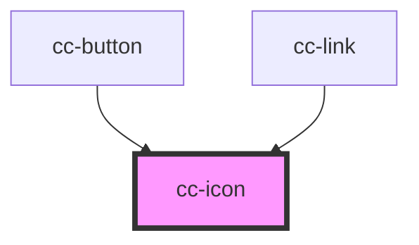

# cc-icon

<!-- Auto Generated Below -->

## Properties

| Property | Attribute | Description            | Type     | Default       |
| -------- | --------- | ---------------------- | -------- | ------------- |
| `icon`   | `icon`    | What icon do you need? | `string` | `'undefined'` |

## Dependencies

### Used by

 - [cc-button](../cc-button)
 - [cc-link](../cc-link)

### Graph

----------------------------------------------

*Built with [StencilJS](https://stenciljs.com/)*
