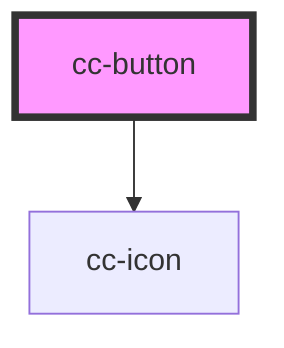

# cc-button

<!-- Auto Generated Below -->

## Properties

| Property  | Attribute | Description                     | Type                | Default |
| --------- | --------- | ------------------------------- | ------------------- | ------- |
| `href`    | `href`    | Do you want to link a document? | `boolean \| string` | `false` |
| `primary` | `primary` | Do you want an primary button?  | `boolean`           | `false` |

## Dependencies

### Depends on

- [cc-icon](../cc-icon)

### Graph

----------------------------------------------

*Built with [StencilJS](https://stenciljs.com/)*
