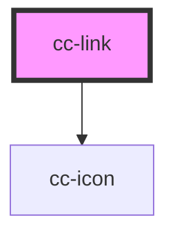

# cc-link

<!-- Auto Generated Below -->

## Properties

| Property   | Attribute  | Description                       | Type      | Default |
| ---------- | ---------- | --------------------------------- | --------- | ------- |
| `external` | `external` | Is the linked ressource external? | `boolean` | `false` |
| `href`     | `href`     | What do you want to link?         | `string`  | `'#'`   |

## Dependencies

### Depends on

- [cc-icon](../cc-icon)

### Graph

----------------------------------------------

*Built with [StencilJS](https://stenciljs.com/)*
